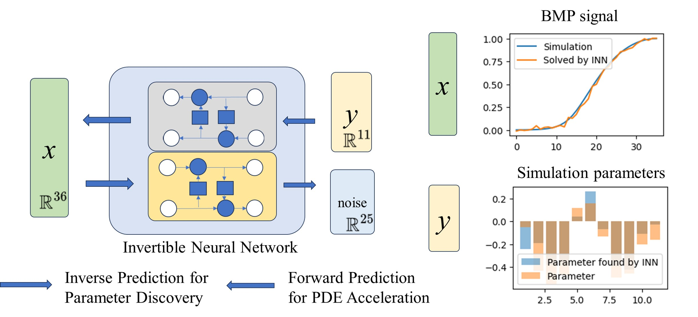

# Inverse Problem Antidote (IPA): Modeling of Systems Biology Model with Invertible Neural Networks
This is the official repository for the implementation of our [BIBM workshop paper](https://ieeexplore.ieee.org/abstract/document/10822632/?casa_token=lCdROsfjNxIAAAAA:xAHR0jApJnX8yvVhbvZKHra-X0kw1jmDTjFMFfiOpcSLS4hwX6y1hG0YDrhEBvrAyiIBA8xK). 




## Getting Started

Follow these steps to set up your environment and replicate the results:

### Step 1: Configure the Environment

This project requires specific libraries including PyTorch, NumPy, tqdm, pandas, and FrEIA. We recommend using Conda to create a virtual environment and install these dependencies. Execute the following commands:

```
conda create --name your_environment_name python=3.9
conda activate your_environment_name
conda install pytorch numpy tqdm pandas
pip install FrEIA
```

Replace `your_environment_name` with your desired environment name.

### Step 2: Download the Dataset

We will release the dataset upon the publication of our paper. In the meantime, you can use the synthetic data to test the model. For synthetic data generation, please run the script:

```
cd 1D data
run Syn.ipynb
```
Please change the filename in INNencoder.py to run the synthetic data. 


### Step 3: Train the Network

To start the training process, activate your environment and run the training script:

```
conda activate your_environment_name
cd src
python INNencoder.py
```

### Step 4: Test the Results

After training, evaluate the model to test the results:

```
cd src
# Run the following notebook for testing
run INNencoder-test.ipynb
```

Follow the instructions in `INNencoder-test.ipynb` to execute the test procedures.


### Acknowledgments
We developed our Invertible Neural Network (INN) leveraging the framework provided by [FrEIA](https://github.com/vislearn/FrEIA) on GitHub.

### Citation

If you find this repository useful, please consider citing our work:

```bibtex
@INPROCEEDINGS{10822632,
  author={Li, Linlin and Lu, Shenyu and Umulis, David M. and Wang, Xiaoqian},
  booktitle={2024 IEEE International Conference on Bioinformatics and Biomedicine (BIBM)}, 
  title={Inverse Problem Antidote (IPA): Modeling of Systems Biology Model with Invertible Neural Networks}, 
  year={2024},
  pages={6218-6225},
  keywords={Training;Inverse problems;Biological system modeling;Computational modeling;Neural networks;Biological processes;Predictive models;Mathematical models;Data models;Optimization;Invertible modeling;PDE;Systems Biology Model},
  doi={10.1109/BIBM62325.2024.10822632}}


